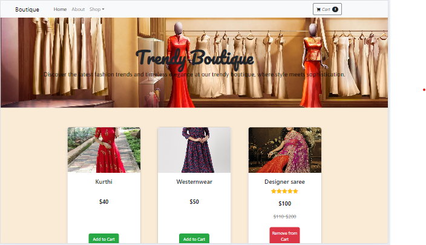

# Trendy Boutique E-Commerce Application

This is a simple e-commerce application for a boutique that allows users to browse products, add items to their cart, and manage the cart. The application is built using React and features components for the navbar, header, product cards, and footer.

## Features

- **Responsive Navbar**: A navigation bar that includes links to different sections of the website and a cart icon showing the number of items in the cart.
- **Header Section**: A visually appealing header with a background image and an introductory message.
- **Product Cards**: Display of products in a grid format, with options to add or remove items from the cart.
- **Cart Management**: The cart count updates dynamically as items are added or removed.
- **Conditional Rendering**: Components are rendered conditionally based on the state of the application.

### Project Link: https://reactshoppingcarttask3.netlify.app

###
